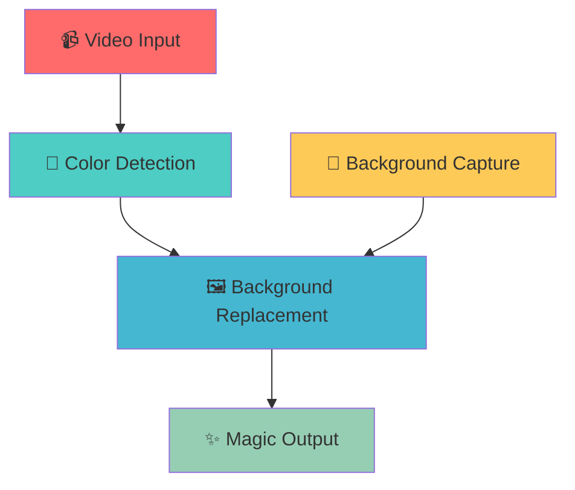

# 🪄 INVISIBLE CLOAK ✨

<div align="center">


### *"Of course it is happening inside your head, Harry, but why on earth should that mean it is not real?"*


</div>

---

## 🌟 Project Overview

<div align="center">

</div>

This project brings the **magical invisibility cloak** from Harry Potter to life using cutting-edge computer vision! 🎩✨ 

Transform yourself into a wizard with real-time invisibility effects powered by **Python** and **OpenCV**. The system uses advanced chroma key technology (similar to green screen) to create seamless invisibility illusions.

<div align="center">

</div>

---

## 🚀 Features

<div align="center">

</div>

| Feature | Description |
|---------|-------------|
| 🎥 **Real-Time Processing** | Live video stream processing with zero lag |
| 🖼️ **Smart Background Capture** | Automatic background detection and replacement |
| 🎭 **Chroma Key Magic** | Advanced color-based invisibility algorithm |
| 📱 **Mobile Integration** | Works with IP webcam from your smartphone |
| 🖥️ **Full-Screen Experience** | Immersive full-screen magical experience |
| 🎮 **Interactive Controls** | Easy-to-use quit button and keyboard shortcuts |
| ⚡ **High Performance** | Optimized for smooth real-time operation |

---

## 🛠️ Tech Stack

<div align="center">

</div>

<div align="center">

### Core Technologies


</div>

| Technology | Purpose | Version |
|------------|---------|---------|
|  | Core Programming Language | 3.7+ |
|  | Computer Vision & Image Processing | 4.0+ |
|  | Numerical Computing & Array Operations | Latest |

---

## 📋 Prerequisites

<div align="center">

</div>

### System Requirements
- **Python 3.7+** installed on your system
- **Webcam** or **IP Camera** setup
- **Red colored cloth/object** for the cloak effect
- **Stable lighting conditions** for best results

### Required Libraries

```bash
pip install opencv-python numpy
```

<div align="center">

</div>

---

## ⚡ Quick Start

<div align="center">

</div>

### 1. 📱 Setup Mobile IP Webcam

<details>
<summary>📱 Android Setup</summary>

1. Install **"IP Webcam"** from Google Play Store
2. Open the app and tap **"Start Server"**
3. Note the IP address (e.g., `http://192.168.1.100:8080/video`)
4. Ensure both devices are on the **same Wi-Fi network**

</details>

<details>
<summary>🍎 iOS Setup</summary>

1. Install **"EpocCam"** or similar IP webcam app
2. Follow the app's setup instructions
3. Get the streaming URL
4. Connect to the same Wi-Fi network

</details>

### 2. 🔧 Configure the Code

```python
# Update this line in invisible_cloak.py
camera_url = "http://YOUR_PHONE_IP:8080/video"
```

### 3. 🎬 Run the Magic

```bash
python invisible_cloak.py
```

<div align="center">

</div>

### 4. 🎭 Become Invisible!

1. **Step out of frame** during background capture (3-5 seconds)
2. **Put on your red cloak** and step back into frame
3. **Wave your hands** and watch the magic happen! ✨
4. **Click "Quit"** or press `q` to exit

---

## 🎨 How It Works

<div align="center">

</div>

### The Magic Behind the Scenes

1. **Background Capture** 🖼️
   - System captures a clean background image
   - Stores this as reference for invisibility effect

2. **Color Detection** 🎨
   - Identifies red color range in HSV color space
   - Creates a mask for the cloak area

3. **Chroma Key Processing** 🔄
   - Replaces masked red areas with background
   - Blends the result seamlessly

4. **Real-Time Rendering** ⚡
   - Processes 30+ FPS for smooth experience
   - Updates display in real-time

<div align="center">



</div>

---

## 🎮 Controls & Usage

<div align="center">

</div>

### Keyboard Shortcuts
| Key | Action |
|-----|--------|
| `Q` | Quit Application |
| `ESC` | Emergency Exit |
| `SPACE` | Recapture Background |

### Mouse Controls
- **Click "Quit" Button** - Clean exit from application

---

## 🛠️ Troubleshooting

<div align="center">

</div>

<details>
<summary>🔧 Common Issues & Solutions</summary>

### Camera Connection Issues
```
❌ Error: Could not open video device
✅ Solution: 
   - Ensure IP webcam app is running
   - Check Wi-Fi connection
   - Verify IP address is correct
```

### Color Detection Problems
```
❌ Issue: Cloak not disappearing properly
✅ Solution:
   - Use bright, solid red colored cloth
   - Ensure good lighting conditions
   - Adjust HSV values in code if needed
```

### Performance Issues
```
❌ Issue: Laggy video output
✅ Solution:
   - Close other heavy applications
   - Use a solid colored background
   - Ensure stable network connection
```

</details>

---

## 🎯 Future Enhancements

<div align="center">

</div>

- [ ] 🌈 Multiple color cloak support
- [ ] 🤖 AI-powered edge detection
- [ ] 📱 Mobile app version
- [ ] 🎨 Custom background selection
- [ ] 🎵 Sound effects integration
- [ ] 🎭 Multiple person support
- [ ] 📊 Performance analytics

---

## 🤝 Contributing

<div align="center">

</div>

We welcome contributions! Here's how you can help:

1. 🍴 **Fork** the repository
2. 🌿 **Create** your feature branch (`git checkout -b feature/AmazingFeature`)
3. 💾 **Commit** your changes (`git commit -m 'Add some AmazingFeature'`)
4. 📤 **Push** to the branch (`git push origin feature/AmazingFeature`)
5. 🔀 **Open** a Pull Request

---

## 📄 License

<div align="center">

</div>

This project is licensed under the **MIT License** - see the [LICENSE](LICENSE) file for details.

---

## 🌟 Show Your Support

<div align="center">

If you found this project helpful, please consider:

[](https://github.com/abhinav29102005/INVISIBLE-CLOAK/stargazers)
[](https://github.com/abhinav29102005/INVISIBLE-CLOAK/network/members)
[](https://github.com/abhinav29102005/INVISIBLE-CLOAK/issues)


**Give it a ⭐ if you liked this project!**

</div>

---

## 👨‍💻 Connect With Me

<div align="center">


### Abhinav Singh

*Computer Vision Enthusiast | Python Developer | Magic Creator*

<div align="center">

[](https://linkedin.com/in/bigboyaks)
[](mailto:asingh3_be24@thapar.edu)
[](https://github.com/abhinav29102005)

</div>


### *"Magic is not about having special powers, it's about making the impossible seem possible through technology!"* ✨

</div>

---

<div align="center">


**Made with ❤️ and a touch of magic**


</div>
